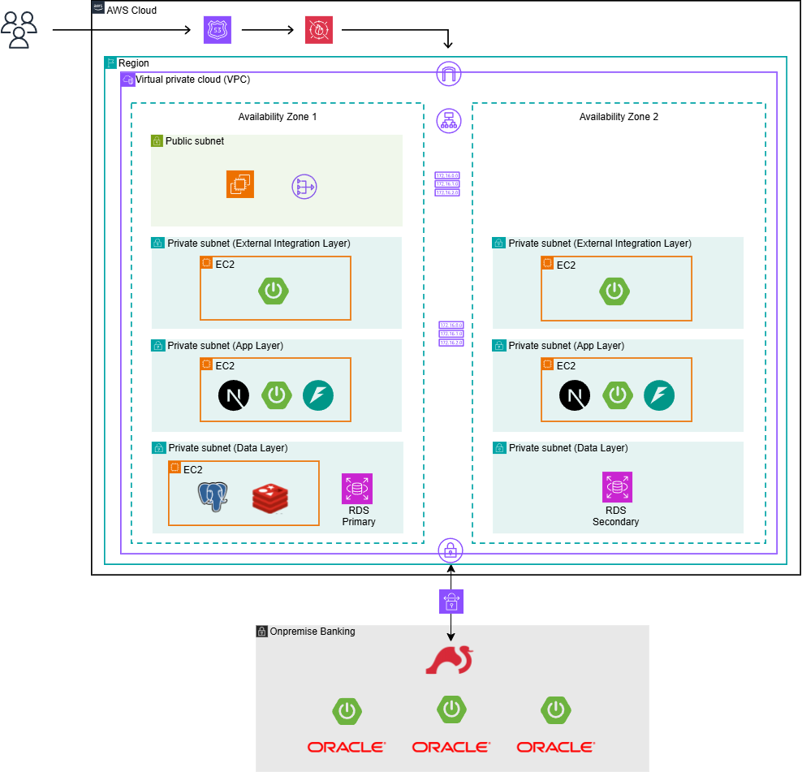
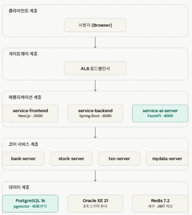
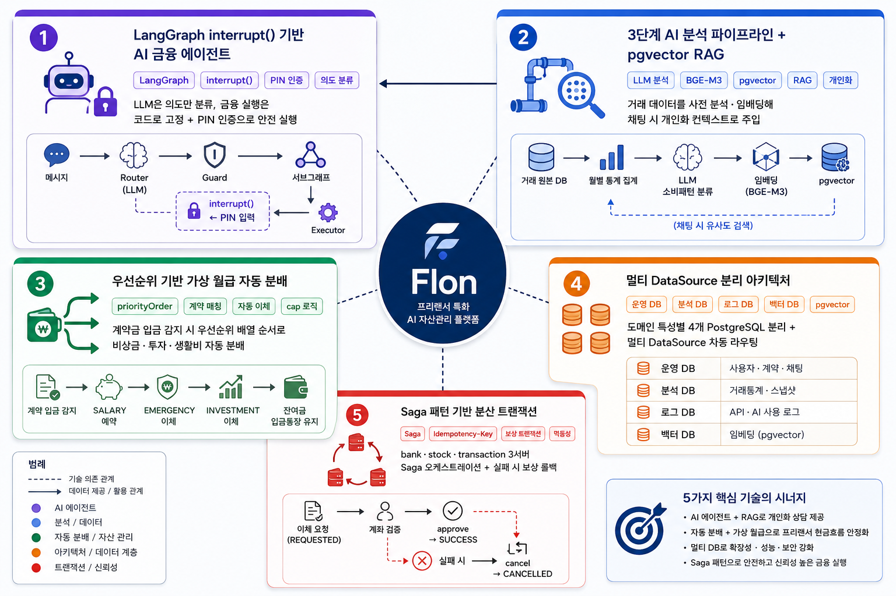
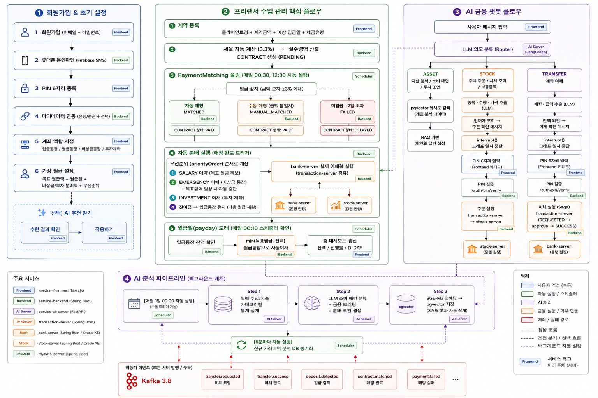

# [우리FISA 6기] 클라우드 서비스 개발 과정 4팀

## 1\. 프로젝트 개요

- **주제** : Flon — 프리랜서 특화 AI 자산관리 플랫폼
- **프로젝트 기획 배경** : 프리랜서는 수입이 불규칙하여 일반적인 월급 기반 자산관리 서비스를 활용하기 어렵습니다. 계약금이 입금될 때마다 비상금·투자·생활비 통장으로 자동 분배하고, 생활비는 설정한 금액만큼 정기 지급(가상 월급)되도록 구조화함으로써 불규칙한 수입을 안정적으로 관리할 수 있는 서비스를 기획했습니다. 여기에 개인 거래 데이터를 기반으로 소비 패턴을 분석하고, AI가 주식 주문·계좌 이체 등 금융 액션을 직접 실행할 수 있는 대화형 금융 어시스턴트를 함께 제공합니다.
- **기술 스택** :
  - **Frontend** : Next.js 15, TypeScript
  - **Backend** : Java 17, Spring Boot 3.x, Spring Security + JWT, PostgreSQL 16, Redis 7.2, Firebase Admin SDK
  - **AI Server** : Python 3.11, FastAPI, LangGraph, Qwen3 / Gemini LLM, BGE-M3 임베딩, pgvector
  - **Infra** : Docker Compose, Kafka 3.8, Oracle XE 21 (은행·증권 원장), Nginx, PostgreSQL (운영·분석·로그·벡터 멀티 DB)

---

## 2\. 아키텍쳐

### 2-1. 시스템 아키텍쳐



### 설명

사용자는 ALB를 통해 AWS 서비스망에 접근하며, service-frontend(Next.js)와 service-backend(Spring Boot)가 사용자 서비스와 인증·비즈니스 로직을 처리합니다. AI 분석 및 챗봇 기능은 service-ai-server에서 수행하고, 외부 금융기관은 별도 영역의 mydata-server에서 담당합니다. 중요한 운영 데이터는 Amazon RDS에 저장하고, 분석/로그/벡터 데이터와 Redis 캐시는 Data Layer에 분리하여 관리합니다. 금융 원장 시스템은 보안성과 독립성을 위해 온프레미스 계정계망에 분리 배치하였으며, bank-server / stock-server / transaction-server(채널계) Oracle 기반 원장을 관리합니다. AWS와 온프레미스는 Site-to-Site VPN으로 연결되며, 은행 서버와 증권 서버 사이의 이체와 같은 분산 금융 거래는 Saga 패턴과 Reconciliation으로 정합성과 장애 복구를 보장합니다.

### 2-2. 소프트웨어 아키텍처



### 설명

service-frontend는 페이지·컴포넌트·API 클라이언트의 3계층으로 구성되며, service-backend만 직접 호출합니다. service-backend는 도메인 레이어(auth·account·virtualsalary·aichat 등)와 글로벌 레이어(Security·Client·Filter)로 분리되고, 멀티 DataSource 설정으로 운영·분석·로그 DB를 라우팅합니다. service-ai-server는 LangGraph StateGraph 기반으로 의도 분류(Router) → 정책 검사(Guard) → 도메인별 서브그래프(Asset/Stock/Transfer) → PIN 인증(Verifier) → 실행(Executor) 순서로 고정된 파이프라인을 따릅니다.

---

## 3\. 주요 기능 소개

### 3-1. 핵심 기술 구성



#### 1. LangGraph interrupt() 기반 AI 금융 에이전트

금융권 특성상 LLM의 hallucination으로 인한 오실행을 방지하기 위해, **LLM의 역할을 의도 분류(ASSET / STOCK / TRANSFER)와 정보 추출로만 제한**하고 실제 금융 액션 실행 경로는 코드 레벨에서 고정했습니다.

주식 주문·계좌 이체 실행 전에는 LangGraph의 `interrupt()`로 그래프를 일시 중단하고 PIN 입력을 대기합니다. 프론트엔드에서 PIN 6자리를 입력하면 `isPin: true` 플래그와 함께 메시지를 재전송하고, 백엔드는 `Command(resume=pin)`으로 이전 State를 완전히 복원해 실행을 이어갑니다. PIN 검증은 service-backend의 `/auth/pin/verify` API에 위임하여 인증 책임을 분리했습니다.

#### 2. 3단계 AI 분석 파이프라인 + pgvector RAG

채팅 시점에 실시간으로 분석하지 않고, 사전 생성된 개인화 데이터를 활용해 응답 속도를 높이는 구조입니다.

- **Step 1 (통계 집계)** : `analysis_raw_transaction` → 월별 수입/지출 카테고리별 통계 집계
- **Step 2 (LLM 분석)** : 월별 통계 → LLM이 소비 패턴 분류 · 금융 브리핑 · 분배 추천 생성
- **Step 3 (임베딩 저장)** : 분석 결과 텍스트 → BGE-M3 / Gemini 임베딩 → pgvector 저장 (3개월 초과 데이터 자동 삭제)

채팅 시 질문 임베딩으로 유사도 검색 후 LLM 프롬프트에 개인 데이터를 컨텍스트로 제공하여 개인화 금융 상담을 구현합니다. 파이프라인은 매월 1일 00:00에 전체 사용자 대상으로 자동 실행되며, 5분 단위로 신규 거래내역을 분석 DB에 동기화합니다.

#### 3. 우선순위 기반 가상 월급 자동 분배

계약 등록 → 입금 감지(PaymentMatching 폴링) → 자동 매칭 → **우선순위 기반 자동 분배**의 전체 흐름을 서버 사이드에서 처리합니다.

사용자가 설정한 `priorityOrder` 배열(예: `["SALARY", "EMERGENCY", "INVESTMENT"]`) 순서로 분배 금액을 계산하며, 계좌 잔액이 부족하면 우선순위가 높은 항목을 먼저 채우는 cap 로직을 적용합니다. 비상금 목표 금액(`emergencyTargetAmount`) 달성 시 해당 이체를 자동으로 중단합니다. 분배 실행은 bank-server와의 실제 이체 API 호출로 처리됩니다.

#### 4. 멀티 DataSource 분리 아키텍처

서비스 특성에 따라 4개의 독립 데이터베이스를 운영합니다.

| DataSource | 용도                                     | 기술                     |
| ---------- | ---------------------------------------- | ------------------------ |
| 운영 DB    | 사용자, 계약, AI 채팅, 알림              | PostgreSQL 16            |
| 분석 DB    | 거래 원천 데이터, 월별 통계, 자산 스냅샷 | PostgreSQL 16            |
| 로그 DB    | 로그인 이력, API 호출 로그, AI 사용 로그 | PostgreSQL 16            |
| 벡터 DB    | AI 임베딩 벡터, 개인화 분석 메타데이터   | PostgreSQL 16 + pgvector |

Spring Boot의 `AbstractRoutingDataSource` 기반 멀티 DataSource 설정으로 도메인별로 올바른 DB에 자동 라우팅합니다.

#### 5. Saga 패턴 기반 분산 트랜잭션 (이체/주문)

bank-server / stock-server / transaction-server 3개 서버에 걸친 이체·주문을 Saga 오케스트레이션으로 처리합니다.

이체 요청(REQUESTED) → 계좌 유효성 검증 → 승인(approve) → 잔액 반영의 단계로 진행하며, 중간 실패 시 보상 트랜잭션(cancel API)으로 상태를 CANCELLED로 전이합니다. `Idempotency-Key` 헤더로 중복 요청을 방지하고, 이미 SUCCESS/CANCELLED 상태인 경우 재처리 없이 멱등 응답을 반환합니다.

---

### 3-2. 통합 워크플로우 다이어그램



---

### 3-3. 세부 기능 소개

#### [AI 금융 챗봇 — 주식 주문·계좌 이체 실행]

- **기능 설명** : LangGraph 기반 AI 에이전트가 사용자 메시지를 ASSET / STOCK / TRANSFER 의도로 분류하고, 주식 주문·이체 등 금융 액션 전 PIN 인증을 거쳐 실행합니다. service-backend가 세션·메시지 저장을 담당하고, AI 응답 생성은 service-ai-server에 위임하는 역할 분리 구조입니다. 프론트엔드는 `requirePin` 플래그를 수신하면 PIN 키패드를 노출하고, 6자리 입력 완료 시 `isPin: true`로 재전송합니다. `actionRequired` 플래그로 금융 액션 결과(주문 완료, 이체 완료)를 카드 형태 UI로 구분 렌더링합니다.

- **핵심 코드 (service-ai-server — interrupt 기반 PIN 인증)**:

```python
# src/agent/nodes/verifier.py
@log_node("Verifier")
async def verifier_node(state: ChatAgentState) -> dict:
    ai_msgs = [m for m in state.get("messages", []) if m.get("role") == "assistant"]
    confirm_msg = ai_msgs[-1]["content"] if ai_msgs else "PIN을 입력해 주세요."
    pin = interrupt(confirm_msg)   # 그래프 일시 중단 → Frontend PIN 입력 대기

    result = await verify_pin(str(pin).strip(), token=state.get("token"))
    matched = result.get("matched", False)

    if intent == "STOCK":
        return {"stock_pin_verified": matched}
    elif intent == "TRANSFER":
        return {"transfer_pin_verified": matched}
```

- **핵심 코드 (service-frontend — PIN 재전송)**:

```typescript
// src/components/main/ChatBotView.tsx
const handlePinPress = async (value: string) => {
  const next = pin + value;
  setPin(next);
  if (next.length < 6) return;

  // PIN 6자리 완성 시 isPin: true 플래그와 함께 재전송
  const data = await apiRequest("/ai/chat/run", {
    method: "POST",
    body: JSON.stringify({
      sessionId,
      message: next,
      isPin: true,
      accountId: stockAccountId,
    }),
  });
  if (data.requirePin || data.actionRequired) setRequirePin(true);
};
```

- **코드 링크** :
  - [service-ai-server/src/agent/nodes/verifier.py](https://github.com/fisa-service-4/service-ai-server/blob/develop/src/agent/nodes/verifier.py)
  - [service-ai-server/src/agent/graph.py](https://github.com/fisa-service-4/service-ai-server/blob/develop/src/agent/graph.py)
  - [service-frontend/src/components/main/ChatBotView.tsx](https://github.com/fisa-service-4/service-frontend/blob/develop/src/components/main/ChatBotView.tsx)

---

#### [AI 분석 파이프라인 — 개인화 RAG 기반 금융 상담]

- **기능 설명** : 사용자의 거래 데이터를 3단계 파이프라인으로 사전 처리합니다. 거래 원본 데이터를 월별 수입·지출 카테고리별로 집계한 후, LLM이 소비 패턴 분류·금융 브리핑·분배 추천을 생성합니다. 결과를 임베딩 벡터로 변환해 pgvector에 저장하고, AI 채팅 시 질문과 유사한 개인 분석 데이터를 검색해 LLM 프롬프트에 삽입함으로써 개인화 상담을 제공합니다. 파이프라인은 매월 1일 전체 사용자 대상 자동 실행되며, 수동 트리거 API도 제공합니다.

- **핵심 코드 (service-ai-server — LLM 분석 파이프라인)**:

```python
# src/pipeline/steps/llm_analysis.py
def _build_prompt(income_rows: list, expense_rows: list) -> str:
    income_text = "\n".join([
        f"- {r['year_month']}: 총수입 {int(r['total_income']):,}원 "
        f"(프리랜서 {int(r['freelancer_income'] or 0):,} / "
        f"투자수익 {int(r['investment_income'] or 0):,} / "
        f"증감률 {r['income_growth_rate']}%)"
        for r in income_rows
    ])
    avg_income = sum(float(r["total_income"]) for r in income_rows) / len(income_rows)
    min_income = min(float(r["total_income"]) for r in income_rows)
    return f"""당신은 프리랜서 전문 AI 금융 어드바이저입니다.
아래 월별 수입/지출 데이터를 분석하고 JSON 형식으로만 응답하세요.
평균 수입: {avg_income:,.0f}원 / 최저 수입: {min_income:,.0f}원
{income_text}"""
```

- **코드 링크** :
  - [service-ai-server/src/pipeline/steps/llm_analysis.py](https://github.com/fisa-service-4/service-ai-server/blob/develop/src/pipeline/steps/llm_analysis.py)
  - [service-ai-server/src/pipeline/steps/embedding.py](https://github.com/fisa-service-4/service-ai-server/blob/develop/src/pipeline/steps/embedding.py)
  - [service-ai-server/src/pipeline/steps/stat_analysis.py](https://github.com/fisa-service-4/service-ai-server/blob/develop/src/pipeline/steps/stat_analysis.py)

---

#### [가상 월급 자동 분배 — 우선순위 기반 계좌 분배]

- **기능 설명** : 프리랜서 계약금 입금이 감지되면 사용자가 설정한 우선순위(`priorityOrder`)에 따라 비상금·투자·생활비 통장으로 자동 분배합니다. SALARY(목표 월급 예약) → EMERGENCY(비상금 이체) → INVESTMENT(투자 이체) 순서로 처리하며, 계좌 잔액이 부족하면 우선순위가 높은 항목을 먼저 채우는 cap 로직으로 이체 금액을 조정합니다. 비상금 목표 금액 달성 시 자동으로 이체를 중단하며, 실제 이체는 transaction-server API를 통해 처리됩니다.

- **핵심 코드 (service-backend — 우선순위 분배 계산)**:

```java
// AutoDistributionServiceImpl.java
private DistributionResult calculate(
    BigDecimal actualIncome, BigDecimal incomeBalance, VirtualSalarySetting setting) {

  List<VirtualSalaryCategory> order = setting.getPriorityOrder();
  BigDecimal distributable = actualIncome;
  BigDecimal salaryReserved = ZERO, emergencyAmount = ZERO, investmentAmount = ZERO;

  for (VirtualSalaryCategory cat : order) {
    switch (cat) {
      case SALARY    -> { salaryReserved = setting.getTargetSalary().min(distributable);
                         distributable = distributable.subtract(salaryReserved); }
      case EMERGENCY -> { if (setting.getEmergencyAmount() != null) {
                           emergencyAmount = setting.getEmergencyAmount().min(distributable);
                           distributable = distributable.subtract(emergencyAmount); } }
      case INVESTMENT -> { if (setting.getInvestmentAmount() != null) {
                            investmentAmount = setting.getInvestmentAmount().min(distributable);
                            distributable = distributable.subtract(investmentAmount); } }
    }
  }
  // 잔액 부족 시 우선순위 기반 cap 적용
  BigDecimal effectiveBalance = incomeBalance.subtract(salaryReserved).max(ZERO);
  if (effectiveBalance.compareTo(emergencyAmount.add(investmentAmount)) < 0) {
    BigDecimal[] capped = capByBalance(emergencyAmount, investmentAmount,
                                       effectiveBalance, emergencyBeforeInvestment(order));
    emergencyAmount = capped[0]; investmentAmount = capped[1];
  }
  return new DistributionResult(salaryReserved, emergencyAmount, investmentAmount, distributable);
}
```

- **핵심 코드 (service-frontend — 드래그 우선순위 설정 UI)**:

```typescript
// src/components/main/VirtualSalarySettingView.tsx
const handleDragOver = (e: React.DragEvent, overIdx: number) => {
  e.preventDefault();
  if (dragIndex === null || dragIndex === overIdx) return;
  const next = [...priorityOrder];
  const [moved] = next.splice(dragIndex, 1);
  next.splice(overIdx, 0, moved);
  setPriorityOrder(next); // SALARY / EMERGENCY / INVESTMENT 우선순위 실시간 재정렬
  setDragIndex(overIdx);
};
```

- **코드 링크** :
  - [service-backend/src/.../AutoDistributionServiceImpl.java](https://github.com/fisa-service-4/service-backend/blob/develop/src/main/java/com/service/domain/virtualsalary/service/AutoDistributionServiceImpl.java)
  - [service-frontend/src/components/main/VirtualSalarySettingView.tsx](https://github.com/fisa-service-4/service-frontend/blob/develop/src/components/main/VirtualSalarySettingView.tsx)

---

#### [홈 대시보드 — 가상 월급 현황 & 수입 캘린더]

- **기능 설명** : BFF 패턴의 단일 API(`/virtual-salary/summary`)로 가상 월급 잔액, 사용률(progress bar), D-DAY(월급일까지 남은 일수), 이번달 계약별 예정 수입 캘린더를 통합 조회합니다. 서버는 UTC 기준으로 D-DAY를 계산하므로 프론트엔드에서 KST(UTC+9) 오프셋 차이를 보정합니다. 잔액 사용률에 따라 progress bar 색상이 파랑(80%+ 잔여) → 주황(30~79%) → 빨강(30% 미만)으로 동적 변경됩니다.

- **핵심 코드 (service-frontend — KST D-DAY 보정)**:

```typescript
// src/components/home/VirtualSalaryCard.tsx
const dday =
  rawDday !== null
    ? (() => {
        const utcNow = new Date();
        const kstNow = new Date(Date.now() + 9 * 3600 * 1000);
        const utcMidnight = Date.UTC(
          utcNow.getUTCFullYear(),
          utcNow.getUTCMonth(),
          utcNow.getUTCDate(),
        );
        const kstMidnight = Date.UTC(
          kstNow.getUTCFullYear(),
          kstNow.getUTCMonth(),
          kstNow.getUTCDate(),
        );
        const dayDiff = Math.round((kstMidnight - utcMidnight) / 86_400_000);
        return rawDday - dayDiff; // UTC D-DAY를 KST 기준으로 보정
      })()
    : null;
```

- **코드 링크** :
  - [service-frontend/src/components/home/VirtualSalaryCard.tsx](https://github.com/fisa-service-4/service-frontend/blob/develop/src/components/home/VirtualSalaryCard.tsx)
  - [service-frontend/src/components/home/IncomeCalendar.tsx](https://github.com/fisa-service-4/service-frontend/blob/develop/src/components/home/IncomeCalendar.tsx)
  - [service-frontend/src/app/(main)/home/page.tsx](<https://github.com/fisa-service-4/service-frontend/blob/develop/src/app/(main)/home/page.tsx>)

---

#### [통합 자산 조회 — 은행·증권 계좌 관리]

- **기능 설명** : 마이데이터 연동으로 은행 계좌(잔액, 거래내역, 카테고리별 지출 합계)와 증권 계좌(예수금, 보유종목)를 통합 조회합니다. 각 계좌에 입금통장(DEPOSIT) / 월급통장(SALARY) / 비상금통장(EMERGENCY) / 투자계좌(STOCK) 역할을 지정하여 가상 월급 자동 분배 시스템과 연계합니다. 계좌 상세 화면에서는 거래내역 필터(기간, 유형)와 함께 카드 결제 건의 가맹점명·카테고리를 표시합니다. 계좌 이체는 PIN 인증 후 service-backend를 통해 실행됩니다.

- **핵심 코드 (service-frontend — 마이데이터 연동 및 계좌 역할 구분)**:

```typescript
// src/components/main/AssetsView.tsx
const ACCOUNT_ROLE_LABEL: Record<string, string> = {
  DEPOSIT: "입금",
  SALARY: "월급",
  EMERGENCY: "비상금",
  STOCK: "주식",
};

// 마이데이터 연동 기관 연결
const connectMyDataInstitution = async (code: string) => {
  setConnectLoading(true);
  await connectMyData({ provider: code }); // 선택한 기관 코드로 연동 요청
  const updated = await getAccounts();
  setAccounts(updated);
};
```

- **코드 링크** :
  - [service-frontend/src/components/main/AssetsView.tsx](https://github.com/fisa-service-4/service-frontend/blob/develop/src/components/main/AssetsView.tsx)
  - [service-frontend/src/components/main/BankAccountDetailView.tsx](https://github.com/fisa-service-4/service-frontend/blob/develop/src/components/main/BankAccountDetailView.tsx)
  - [service-frontend/src/components/main/TransferView.tsx](https://github.com/fisa-service-4/service-frontend/blob/develop/src/components/main/TransferView.tsx)
